# ESPUI

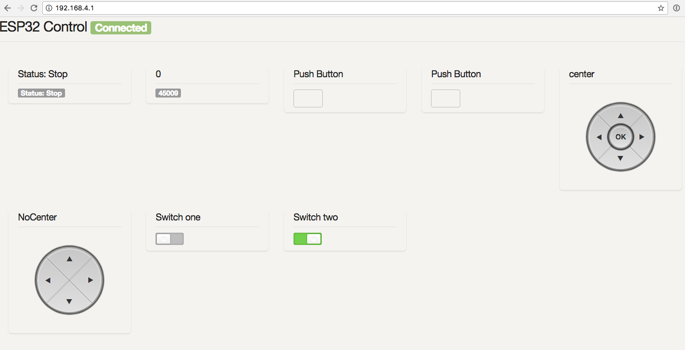

ESPUI is a simple library to make a web-based user interface for your projects using
the **ESP8266** or the **ESP32** It uses web sockets and lets you create,

ol, and update elements on your GUI through multiple devices like phones
and tablets.

ESPUI uses simple Arduino-style syntax for creating a solid, functioning user
interface without too much boilerplate code.

So if you either don't know how or just don't want to waste time: this is your
simple solution user interface without the need of internet connectivity or any
additional servers.

The Library runs on any kind of **ESP8266** and **ESP32** (NodeMCU, AI Thinker, etc.).

- [Dependencies](#dependencies)
- [How to Install](#how-to-install)
- [Getting started](#getting-started)
- [UI Elements](#documentation)
  * [Button](#button)
  * [Switch](#switch)
  * [Buttonpad](#buttonpad)
  * [Labels](#labels)
  * [Slider](#slider)
  * [Number Input](#number-input)
  * [Text Input](#text-input)
  * [Date, Time, Colour and Password Input](#date-time-colour-and-password-input)
  * [Select control](#select-control)
  * [Getting the Time](#getting-the-time)
  * [Separators](#separators)
- [Initialisation of the UI](#initialisation-of-the-ui)
- [Tabs](#tabs)
- [Log output](#log-output)
- [Colours](#colours)
- [Advanced Features](#advanced-features)
  * [Dynamic Visibility](#dynamic-visibility)
  * [Inline Styles](#inline-styles)
  * [Disabling Controls](#disabling-controls)
  * [Grouped controls](#grouped-controls)
  * [Wide controls](#wide-controls)
  * [Graph (Experimental)](#graph--experimental-)
  * [Captive Portal](#captive-portal)
- [Notes for Development](#notes-for-development)
- [Contribute](#contribute)


### Contributed features

- Tabs by @eringerli
- Generic API by @eringerli
- Min Max on slider by @eringerli
- OptionList by @eringerli
- Public Access to ESPAsyncServer
- Inline CSS styles by @iangray001
- Separators by @iangray001
- Grouped and wide controls by @iangray001
- Transport layer rework by @iangray001
- Time control by @iangray001
- Vertical controls by @iangray001
- Time/date/password/color input types by @pcbbc

## Roadmap

- Fully implement graphs
- Expand number input features (floats etc.)
- Support for enabling and disabling controls

## Dependencies

This library is dependent on the following libraries.

- [ESPAsyncWebserver](https://github.com/me-no-dev/ESPAsyncWebServer)
- [ArduinoJson](https://github.com/bblanchon/ArduinoJson) (Last tested with
  version 6.10.0)

- (_For ESP8266_) [ESPAsyncTCP](https://github.com/me-no-dev/ESPAsyncTCP)
- (_For ESP32_) [AsyncTCP](https://github.com/me-no-dev/AsyncTCP)
- (_For ESP32_) [lorol/LittleFS_esp32](https://github.com/lorol/LITTLEFS)

## How to Install

Make sure all the dependencies are installed, then install like so:

#### Using PlatformIO (_recommended_)

Just include this library as a dependency in `lib_deps` like so:

```
lib_deps =
    ESPUI
    ESP Async WebServer
    ESPAsyncTCP # (or AsyncTCP on ESP32)
    LittleFS_esp32 # (ESP32 only)
```

#### Using the Arduino IDE (_recommended_)

You can find this Library in the Arduino IDE library manager. Go to 
`Sketch > Include Library > Library Manager` search for `ESPUI` and install.

If you cannot use the Library Manager, you can download the [repository](https://github.com/s00500/ESPUI/archive/master.zip) and follow
the [instructions to manually install libraries](https://learn.adafruit.com/adafruit-all-about-arduino-libraries-install-use/how-to-install-a-library).

## Getting started

ESPUI serves several files to the browser to build up its web interface. This
can be achieved in 2 ways: _PROGMEM_ or _LITTLEFS_

_When `ESPUI.begin()` is called the default is serving files from Memory and
ESPUI should work out of the box!_

**OPTIONAL:** But if this causes your program to _use too much memory_ you can
burn the files into the LITTLEFS filesystem on the ESP. There are now two ways to
do this: you can either use the ESP file upload tool or you use the library
function `ESPUI.prepareFileSystem()`

#### Simple filesystem preparation (_recommended_)

Just open the example sketch **prepareFileSystem** and run it on the ESP, (give
it up to 30 seconds, you can see the status on the Serial Monitor), The library
will create all needed files. Congratulations, you are done, from now on you
just need to do this again when there is a library update, or when you want to
use another chip :-) Now you can upload your normal sketch, when you do not call
the `ESPUI.prepareFileSystem()` function the compiler will strip out all the
unnecessary strings that are already saved in the chip's filesystem and you have
more program memory to work with.

## User interface Elements

- Label
- Button
- Switch
- Control pad
- Slider
- Text Input
- Date, Time, Colour and Password Input
- Numberinput
- Option select
- Separator
- Time
- Graph (partial implementation)


## Documentation

The heart of ESPUI is [ESPAsyncWebserver](https://github.com/me-no-dev/ESPAsyncWebServer). ESPUI's frontend is based on [Skeleton CSS](http://getskeleton.com/) and jQuery-like lightweight [zepto.js](https://zeptojs.com/) for handling events. The communication between the ESP and the client browser works using web sockets. ESPUI does not need network access and can be used in standalone access point mode, all resources are loaded directly from the ESPs memory.
<br><br>
This section will explain in detail how the Library is to be used from the Arduino code side. In the arduino `setup()` routine the interface can be customised by adding UI Elements. This is done by calling the corresponding library methods on the Library object `ESPUI`. Eg: `ESPUI.button("button", &myCallback);` creates a button in the interface that calls the `myCallback(Control *sender, int eventname)` function when changed. All buttons and items call their callback whenever there is a state change from them. This means the button will call the callback when it is pressed and also again when it is released. To separate different events, an integer number with the event name is passed to the callback function that can be handled in a `switch(){}case{}` statement.
<br><br>
Alternativly you may use the extended callback funtion which provides three parameters to the callback function `myCallback(Control *sender, int eventname, void * UserParameter)`. The `UserParameter` is provided as part of the `ESPUI.addControl` method set and allows the user to define contextual information that is to be presented to the callback function in an unmodified form. 
<br><br>
It also possible to use a lambda function in the callback parameter. It also allows the user to define, in a more C++ way, contextual information in any form. This is shown by the [completeLambda](examples/completeLambda/completeLambda.ino) example.
<br><br>
The below example creates a button and defines a lambda function to invoke a more specialized button callback handler:
```
void YourClassName::setup()
{
  ButtonElementId = ESPUI.addControl(
  ControlType::Button,
  ButtonLabel.c_str(),
  " Button Face Text ",
  ControlColor::None,
  ParentElementId,
  [&](Control *sender, int eventname)
  {
    myButtonCallback(sender, eventname); // class method
  });

  // or
  ButtonElementId = ESPUI.button(
  " Button Face Text ",
  [&](Control *sender, int eventname)
  {
    myButtonCallback(sender, eventname); // class method
  });
}
```
```
void YourClassName::myButtonCallback(Control* sender, int eventname)
{
  if (eventname == B_DOWN)
  {
    // Handle the button down event
  }
  else if (eventname == B_UP)
  {
    // Handle the button up event
  }
}
```
<br>
<br>
#### Button

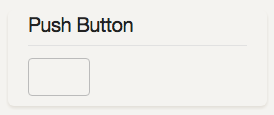

Buttons have a name and a callback value. Their text can be changed at runtime using `ESPUI.updateButton()`.

Events:
- `B_DOWN` - Fired when button is pressed.
- `B_UP` - Fired when button is released.

#### Switch

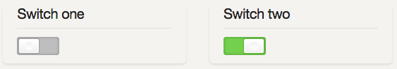

Switches sync their state on all connected devices. This means when you change
their value (either by pressing them, or programmatically using `ESPUI.updateSwitcher()`) they change visibly 
on all tablets or computers that currently display the interface.

Events:
- `S_ACTIVE` - Fired when turning on.
- `S_INACTIVE` - Fired when turning off.

#### Buttonpad

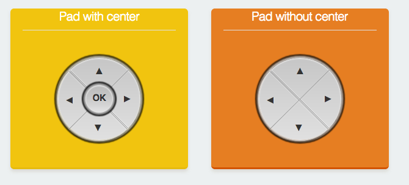

Button pads come in two flavours: with or without a center button. They are
useful for controlling movements of vehicles/cameras etc. They use a single 
callback per pad and have 8 or 10 different event types to differentiate the 
button actions.

- `P_LEFT_DOWN`
- `P_LEFT_UP`
- `P_RIGHT_DOWN`
- `P_RIGHT_UP`
- `P_FOR_DOWN`
- `P_FOR_UP`
- `P_BACK_DOWN`
- `P_BACK_UP`
- `P_CENTER_DOWN`
- `P_CENTER_UP`

#### Labels

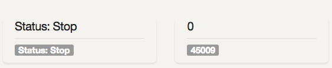

Labels are used to display textual information (i.e. states, values of sensors, 
configuration parameters etc.). To send data from the code use `ESP.updateLabel()` . 
Labels get a name on creation and a initial value.

Labels automatically wrap your text. If you want them to have multiple lines use
the normal `<br>` tag in the string you print to the label.

In fact, because HTML can be used in the label's value, you can make a label display
images by including an `` tag. 

```
 ESPUI.label("An Image Label", ControlColor::Peterriver, "");
```

This requires that the client has access to the image in question, either from the internet or a local web server.


#### Slider

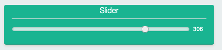

Sliders can be used to select (or display) a numerical value. Sliders provide
realtime data and are touch compatible. Note that like all ESPUI functions, the callback does not return an `int` 
but a `String` so should be converted with the `.toInt()` function. See the examples for more details. Sliders can
be updated from code using `ESP.updateSlider()`.

A slider usually only sends a new value when it is released to save network bandwidth. 
This behaviour can be changed globally by setting `sliderContinuous` before `begin()`:

```
ESPUI.sliderContinuous = true;
ESPUI.begin("ESPUI Control");
```

Events:
 - `SL_VALUE` - Fired when a slider value changes.

#### Number Input

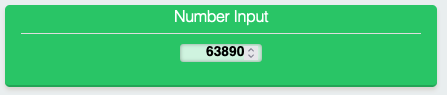

The number input can be used to receive numbers from the user. You can
enter a value into it and when you are done with your change it is sent to the
ESP. A number box needs to have a min and a max value. To set it up just use:

`ESPUI.number("Numbertest", &numberCall, ControlColor::Alizarin, 5, 0, 10);`

Number inputs can be updated from code using `ESP.updateNumber()`.

Note that HTML number boxes will respect their min and max when the user
clicks the up and down arrows, but it is possible on most clients to simply type 
any number in. As with all user input, numbers should be validated in callback code
because all client side checks can be skipped. If any value from the UI might
cause a problem, validate it.

Events:
 - `N_VALUE` - Fired when a number value changes.


#### Text Input

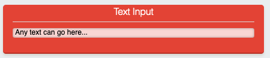

The text input works very similar like the number input but allows any string to be entered. 
If you attach a Max control to the text input then a max length will be applied
to the control. 

```
text = ESPUI.text("Label", callback, ControlColor::Dark, "Initial value");
ESPUI.addControl(ControlType::Max, "", "32", ControlColor::None, text);
```

Text inputs can be updated from code using `ESP.updateText()`.

However even with a set maximum length, user input should still be validated 
because it is easy to bypass client-side checks. Never trust user input.

Events:
 - `T_VALUE` - Fired when a text value changes.


#### Date, Time, Colour and Password Input

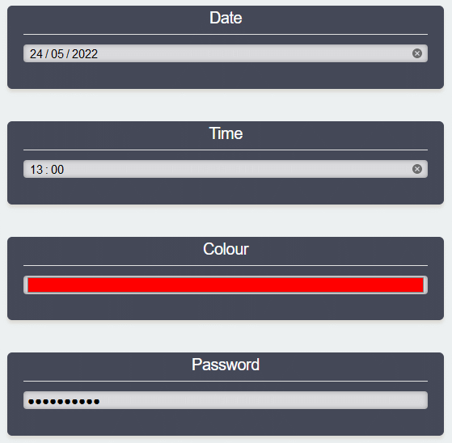

As an extension to the text input control, you can also specify the type attribute to be used for the HTML input element.
This allows you to easily create input controls for Date, Time, Colour and Passwords, or indeed any other
[HTML Input Types](https://www.w3schools.com/html/html_form_input_types.asp) supported by your browser. 

```
text_date = ESPUI.text("Date", callback, ControlColor::Dark, "2022-05-24");
ESPUI.setInputType(text_date, "date");

text_time = ESPUI.text("Time", callback, ControlColor::Dark, "13:00");
ESPUI.setInputType(text_time, "time");

text_colour = ESPUI.text("Colour", callback, ControlColor::Dark, "#FF0000");
ESPUI.setInputType(text_colour, "color");

text_password = ESPUI.text("Password", callback, ControlColor::Dark, "tiddles123");
ESPUI.setInputType(text_password, "password");
```

*Important!* This function should be called _before_ `ESPUI.begin` or results will be unreliable.

Note that not all browsers support all input types, and that the control displayed to edit the input is browser dependent.

However even with a type set, user input should still be validated 
because it is easy to bypass client-side checks. Never trust user input.


#### Select control

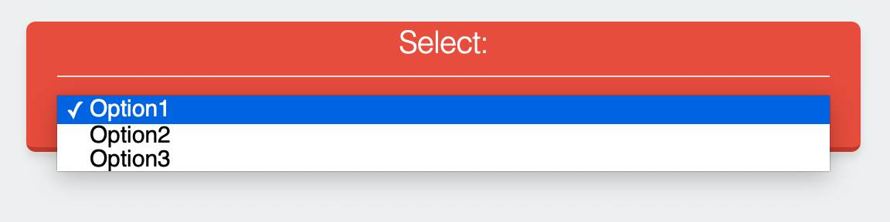
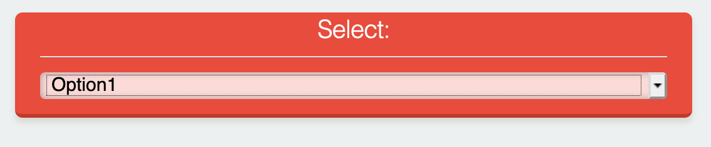

The Select control lets the user select from a predefined list of options. First create a select widget like so

```
uint16_t select1 = ESPUI.addControl( ControlType::Select, "Select Title", "Initial Value", ControlColor::Alizarin, tab1, &selectExample );
```

Then add Options to it, specifying the Select as the parent:

```
ESPUI.addControl( ControlType::Option, "Option1", "Opt1", ControlColor::Alizarin, select1);
ESPUI.addControl( ControlType::Option, "Option2", "Opt2", ControlColor::Alizarin, select1);
ESPUI.addControl( ControlType::Option, "Option3", "Opt3", ControlColor::Alizarin, select1);
```

Check the **tabbedGui** example for a working demo. Selectors can be updated from code using `ESP.updateSelect()`.

Events:
 - `S_VALUE` - Fired when a select value changes.

#### Getting the Time

ESPUI can create an invisible control that can be used to fetch the current time from the client 
when they are connected to the UI. This could be used to intermittently provide an accurate time 
source to your ESP. Remember that clients cannot be relied upon to be correct or truthful. 

Create a Time control with the following:

```
//Add the invisible "Time" control
auto timeId = ESPUI.addControl(Time, "", "", None, 0, timeCallback);
```

After creating the UI, sending an update to the Time control will cause it to fetch the current 
time from the client and then fire its callback with the result.

```
//Request an update to the time
ESPUI.updateTime(timeId);
//Will trigger timeCallback
``` 

In `timeCallback` you can then print the control's value as normal:

```
void timeCallback(Control *sender, int type) {
  if(type == TM_VALUE) { 
    Serial.println(sender->value);
  }
}
```

The returned string will be an [ISO string](https://www.w3schools.com/jsref/jsref_toisostring.asp) as returned by the Javascript `new Date().toISOString()`. The format is `YYYY-MM-DDTHH:mm:ss.sssZ` so for example: `2022-01-20T21:44:22.913Z`.

Events:
 - `TM_VALUE` - Fires when the control is updated with `updateTime()`

#### Separators

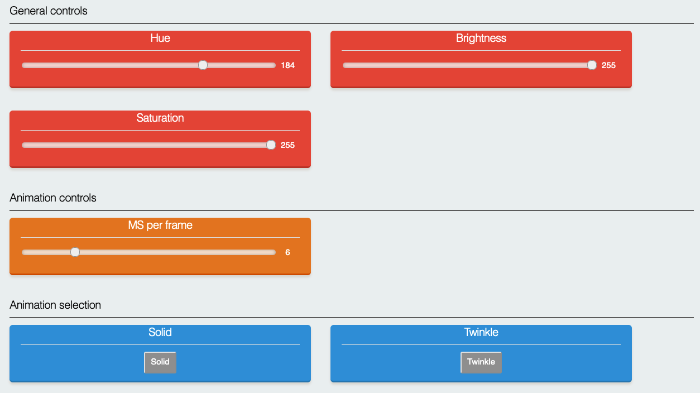

You can use separators to break up the UI and better organise your controls. Adding a separator will force any following controls onto the subsequent line. Add separators as follows:

```
ESPUI.separator("Separator name");
//or
ESPUI.addControl(ControlType::Separator, "Separator name", "", ControlColor::None, maintab);
```

Separators fire no events.

### Initialisation of the UI

After all the elements are configured, call `ESPUI.begin("Some Title");`
to start the UI interface. (Or `ESPUI.beginLITTLEFS("Some Title");` respectively)
Make sure you setup a working network connection or AccessPoint **before** (see
the `gui.ino` example). The web interface can then be used from multiple devices at once and
also shows connection status in the top bar.


### Tabs

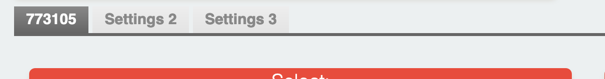

Tabs can be used to organize your controls into pages. Check the **tabbedGui** example to see 
how this is done. Tabs can be created as follows:

```
ESPUI.addControl(ControlType::Tab, "Settings 1", "Settings 1");
```

Then all widgets for the tab need to be added to it by specifying the tab as the parent. Widgets not 
added to a tab will be shown above the tab selctor.

```
ESPUI.addControl(ControlType::Text, "Text Title", "a Text Field", ControlColor::Alizarin, tab1, &textCall);
```

Note that the basic functions to add controls like `ESPUI.button()` or `ESPUI.slider()` do not add to any tab, 
so they are good for building small UIs. However if you need to use tabs then you will have to add all your
controls using the full `ESPUI.addControl()` function.


### Log output

ESPUI has several different log levels. You can set them using the
`ESPUI.setVerbosity(Verbosity::VerboseJSON)` function.

Loglevels are:

- `Verbosity::Quiet` (default)
- `Verbosity::Verbose`
- `Verbosity::VerboseJSON`

VerboseJSON outputs the most debug information.

### Colours

A selection of basic colours are available to use:

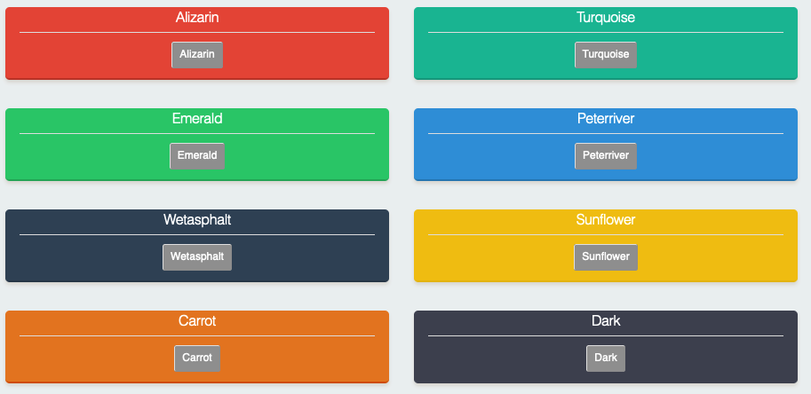

If you want more control over the UI design, see the Inline Styles section below.


## Advanced Features

ESPUI includes a range of advanced features that can customise your UIs.


### Dynamic Visibility

Controls can be made visible or invisible at runtime with the `updateVisibility()` function.

```
ESPUI.updateVisibility(controlId, false);
```

Note that you cannot hide individual controls from a [control group](#grouped-controls), you have to hide the entire group.


### Inline Styles

You can add custom CSS styles to controls. This allows you to style the UI with custom colors, drop shadows, 
or other CSS effects. Add styles with the following functions:

```
setPanelStyle(uint16_t id, String style);
setElementStyle(uint16_t id, String style)
```

A panel style is applied to the panel on which the UI element is placed, an element style is applied to the element itself. 
Because CSS inline styles can only style one specific DOM element, for controls made up of multiple elements (like the pad) 
this is limited. Element styles can be applied to all controls, but will only work correctly for the Button, Label, Slider, 
Switcher, Number, Text, and Selector. 

Dynamic update of styles is supported. When either of the above functions are called, the control is updated live. This could 
be used to refect a warning state by changing the color of a button, or for similar effects.

For example, this code will set a control's panel to a random background color:

```
char stylecol[30];
sprintf(stylecol, "background-color: #%06X;", (unsigned int) random(0x0, 0xFFFFFF));
ESPUI.setPanelStyle(switch1, stylecol);
```

You can get quite creative with this.

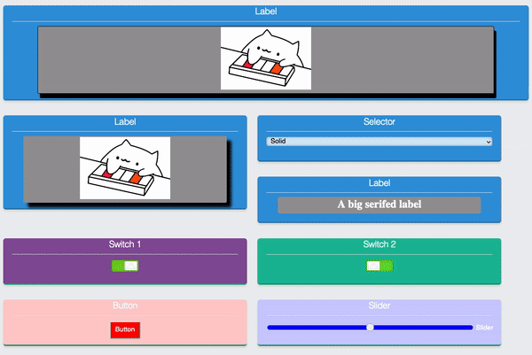

The [completeExample](examples/completeExample/completeExample.cpp) example includes a range of things that you can do with inline styles.

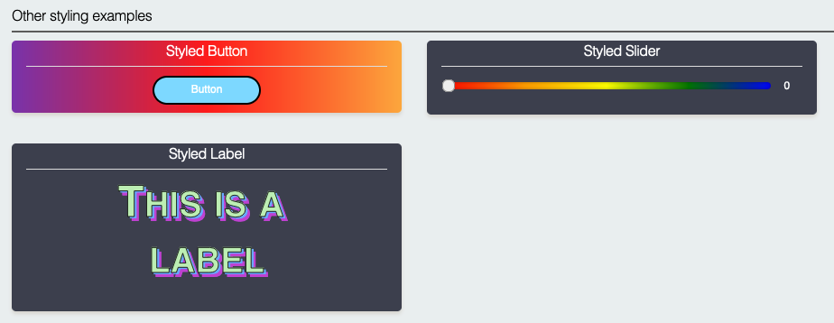


### Disabling Controls

It is possible to dynamically enable and disable controls to, for example, provide feedback to the user that a particular feature is 
temporarily unavailable. To do this use the following function call:

```
ESPUI.setEnabled(controlId, enabled);
```

Setting `enabled` to false will make the control noninteractive and it will visually change to illustrate this to the user. The control
will stop firing any events. Note that whilst the widget will change appearance, the panel of the control will remain whatever colour 
it was set to. If you wish to also change the colour of the panel then you should use inline styles to show the noninteractive state. For example:

```
ESPUI.setEnabled(mainButton, false);
const String disabledstyle = "background-color: #bbb; border-bottom: #999 3px solid;";
ESPUI.setPanelStyle(mainButton, disabledstyle);
```

This CSS style sets the panel background and its border to grey. To put the control back to enabled use the following:

```
ESPUI.setEnabled(mainButton, true);
ESPUI.setPanelStyle(mainButton, ";");
```

Note that we have to set the inline style to `";"` (i.e. an empty CSS rule) because if we just try to set it to `""` this will be 
interpreted as "do not change the style".

Controls can also be set to disabled before the UI is started.

### Grouped controls

Normally, whenever a control is added to the UI, a new panel is generated with a title. However, you can instead 
set the "parent" of a new control to be an existing control. This allows you to add multiple widgets into the same 
panel. For example:

```
panel1 = ESPUI.addControl(ControlType::Button, "Button Set", "Button A", ControlColor::Turquoise, Control::noParent, btncallback);
ESPUI.addControl(ControlType::Button, "", "Button B", ControlColor::None, panel1, btncallback);
ESPUI.addControl(ControlType::Button, "", "Button C", ControlColor::None, panel1, btncallback);
```

The first call to `addControl` has no parent (or it could be set to a tab if you are using a tabbed UI), so therefore a new panel is added containing one button
with the value `Button A`. The two subsequent calls have their parent set to the first control we added, so instead of creating
a new panel, the result is the following:

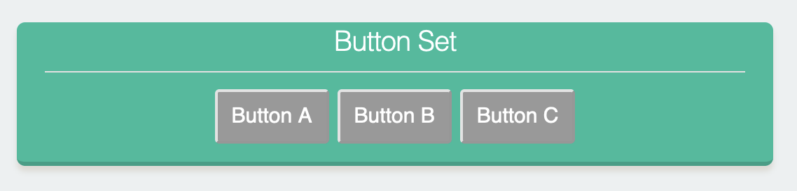

The grouped controls operate entirely independently, and can be assigned different callbacks, or updated separately. The grouping 
is purely visual.

Most controls can be grouped this way, but the result is not always visually pleasant. This works best with labels, sliders, switchers,
and buttons.

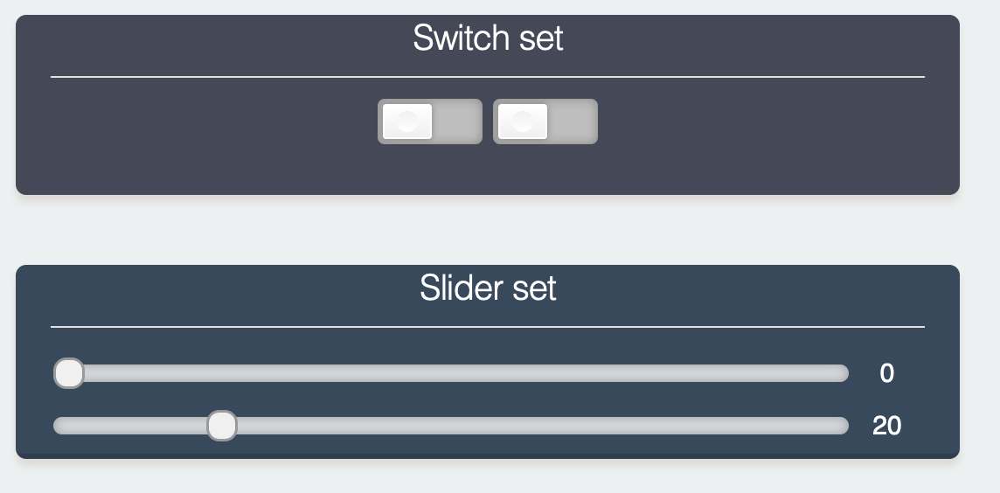

For sliders and switchers, you can also set the controls to be displayed vertically.

```
auto vertswitcher = ESPUI.addControl(Switcher, "Vertical Switcher", "0", Dark, tab1);
ESPUI.setVertical(vertswitcher); 
```

This must be done before `ESPUI.begin()` is called. Vertical layouts are currently only supported for sliders and switchers, and it 
is a purely visual change. Behaviour is identical. Mixing horizontal and vertical controls can result in some unpredictable layouts.

When you add multiple buttons to a single panel, the buttons have a title so they can be differentiated. For sliders and switchers this is
not the case. Therefore you might want to add additional labels so that the controls can be distinguished. There is not yet automatic 
support for doing this, so the approach is to add labels that have been styled using [inline styles](#inline-styles). By doing this 
you can acheieve effects such as this:

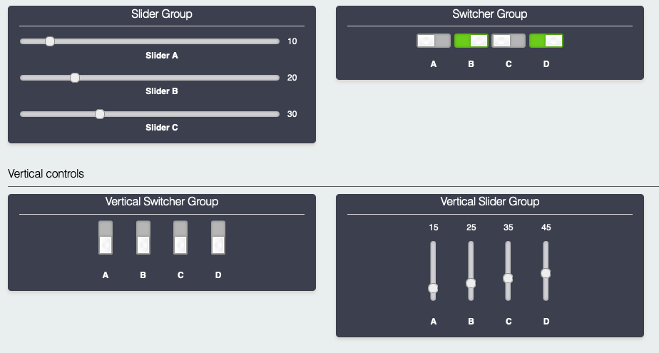

The code to do this is in the [completeExample](examples/completeExample/completeExample.cpp) example.

### Wide controls

Controls can be set to be displayed "wide" with the function:

```
ESPUI.setPanelWide(controlid, true);
```

*Important!* This function should be called _before_ `ESPUI.begin` or results will be unreliable.

Setting a control to wide tells ESPUI to lay out that control as if there was only a single column, even on wide displays. 
This can be applied to every element to force a single column layout, or to individual elements to customise the display.

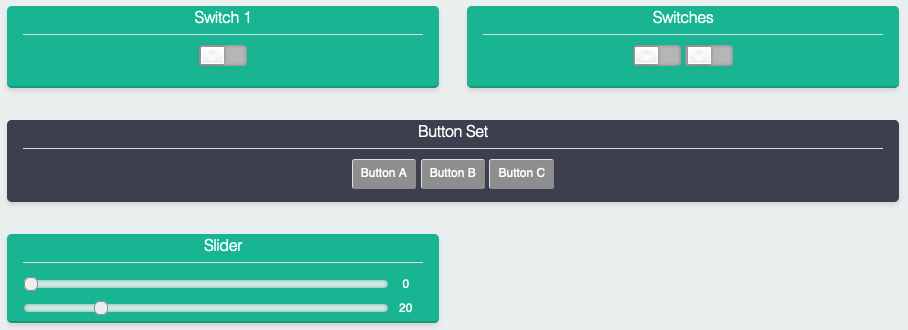

Note that this will have no effect on small screens.


### Graph (Experimental)

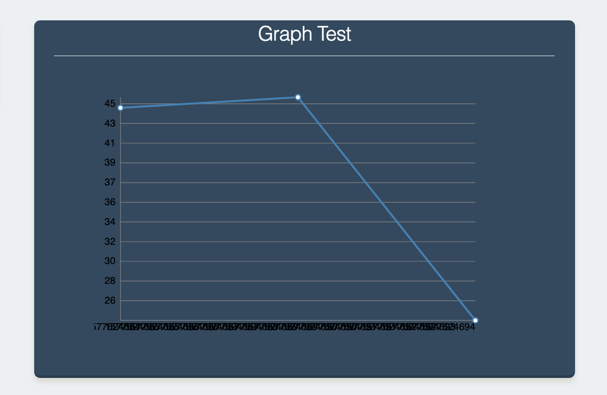

The graph widget can display graph points with timestamp at wich they arrive

Use `ESPUI.addGraphPoint(graphId, random(1, 50));` to add a new value at the current time, use `ESPUI.clearGraph(graphId)` to clear the entire graph.
Graph points are saved in the browser in **localstorage** to be persistant, clear local storageto remove the points or use clearGraph() from a bbutton callback to provide a clear button.

_There are many issues with the graph component currently and work is ongoing. Consider helping us out with development!_

### Captive Portal

ESPUI will redirect all unknown URLs it is asked for to the 'root' of the local HTTP server instead of responding with an HTTP code 404. This makes it act as a simple 'captive portal'. Note you must also set up the ESP to be a DNS server that responds to all DNS requests with the IP address of the ESP. This only effective when the ESP is acting as a WiFi hotspot in AP mode and assigning itself as the DNS server to connected clients. 

All the example sketches include the DNS related code and will work as captive portals when used as a hotspot. In the event you wish to disable this feature you can do so by removing the DNS server code and adding the code below.

```
ESPUI.captivePortal = false;
```


# Notes for Development

If you want to work on the HTML/CSS/JS files, do make changes in the _data_
directory. When you need to transfer that code to the ESP, run
`tools/prepare_static_ui_sources.py -a` (this script needs **python3** with the
modules **htmlmin**, **jsmin** and **csscompressor**). This will generate a) minified files
next to the original files and b) the C header files in `src` that contain the minified and
gzipped HTML/CSS/JS data. Alternatively, you can specify the `--source` and `--target` arguments to the
`prepare_static_ui_sources.py` script (run the script without arguments for
help) if you want to use different locations.

If you don't have a python environment, you need to minify and gzip the
HTML/CSS/JS files manually. I wrote a little useful jsfiddle for this,
[see here](https://jsfiddle.net/s00500/yvLbhuuv/).

If you change something in HTML/CSS/JS and want to create a pull request, please
do include the minified versions and corresponding C header files in your
commits. (Do **NOT** commit all the minified versions for the non changed files)

# Experimental debugging environment using emulation on host

It is possible to run or debug this library on a unix-like computer (Linux,
macOS, WSL) without flashing on hardware, and with your favourite debugging
tools (gdb, valgrind, ...).  This is accomplished through the
esp8266/Arduino "emulation on host" environment.

A fake AsyncWebserver library is needed because lwIP is not yet ported to
the emulation environment.  Full instructions can be found in this project's
[readme page](https://github.com/d-a-v/emuAsync).

## Changelog for 2.1:

 - Adds the ability to have inline styles for widgets and panels
 - Adds LittleFS on the ESP32
 - Cleans up examples
 - Adds Button Animation
 - Adds chunking for the widgets so you can add even more of them
 - Fixes lots of bugs related to invisible UI elements and sliders
 - Adds the ability to change port

## Changelog for 2.0:

- ArduinoJSON 6.10.0 Support
- Split pad into pad and padWithCenter
- Cleaned order of parameters on switch and pad
- Changes all numbers to actually be numbers (slider value, number value, min and max)

# Contribute

Liked this Library? You can **support** me by sending me a :coffee:
[Coffee](https://paypal.me/lukasbachschwell/5).

Otherwise I really welcome **Pull Requests**.
